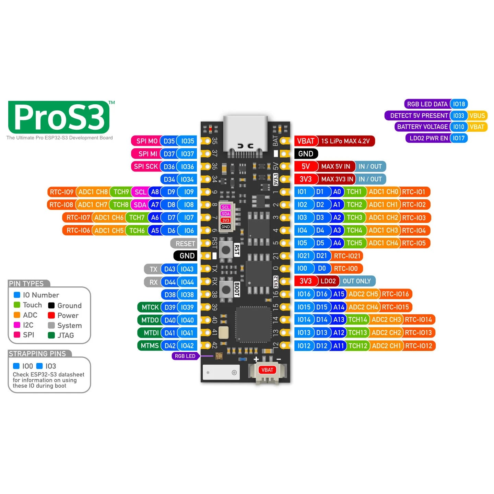

# RipTide.Nfirmware

RipTide uses a 4" ILI9488 TFT display with a resolution of 480x320 pixels

Replace [nf-interpreter ILI9488_480x320_SPI.cpp](https://github.com/nanoframework/nf-interpreter/blob/main/src/nanoFramework.Graphics/Graphics/Displays/ILI9488_480x320_SPI.cpp) display driver with the modified [ILI9488_480x320_SPI.cpp](Assets/ILI9488_480x320_SPI.cpp) display driver with BGR color format support.

Build your own nanoCLR file using [Dev Container](https://docs.nanoframework.net/content/building/using-dev-container.html).

Deploy nanoCLR to board
```bash
nanoff -v d --target ESP32_S3 --serialport COM3 --update --clrfile "c:\\Temp\\nanoCLR.bin"
```

Deploy app settings to board
```bash
./deploy-appsettings.ps1 -nfClient RipTide.Nfirmware -settingsFile AppSettings.PROS3.Dev.json -keyVaultName kv-ts-develop -serialPort COM5
```

Targets:
* ESP32 S3 ProS3: ESP32_S3
* ESP32 S3 DevKitC 1: ESP32_S3_ALL

## Schematic

[RipTide.fzz](Assets/RipTide.fzz)

## Pinout




## Data Sheets

https://www.espressif.com/sites/default/files/documentation/esp32-s3_datasheet_en.pdf